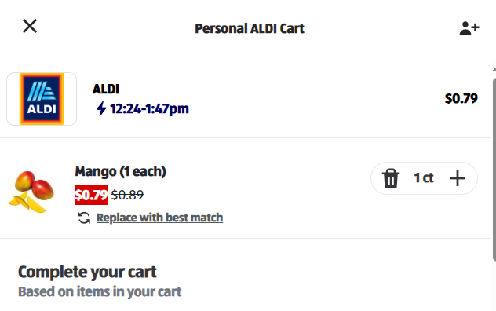

# Task1 Answers

---

## Template for the test cases

Summary: [Test Case] - Short summary of the test case

Browser: List of the browser in which we want to execute these tests

Prerequisite: Steps which has to be done before the test steps

Description / Test Steps: For the documentation of the steps I used the following table template

| #   | Action                   | Result                   |
|-----|--------------------------|--------------------------|
| 1   | Action of the first step | Result of the first step |
| 2   | {Parameter1}             | {Parameter2}             |

| Parameter1                          | Parameter2                          |
|-------------------------------------|-------------------------------------|
| Parameter1 value for the first test | Parameter2 value for the first test |

---

## [Test Case] - Add a single product to the shopping list

Browser: All supported browser

Prerequisite:

* User is logged in
* User is on the https://www.aldi.us/store/aldi/storefront page
* There are items in the webshop which are discounted and which are not

| #   | Action                                           | Result                                                                                                                                          |
|-----|--------------------------------------------------|-------------------------------------------------------------------------------------------------------------------------------------------------|
| 1   | User clicks on the "+ Add" button over {PRODUCT} | Now instead of the "+ Add"  we can see the following elements:  Trash icon, 1 and a + icon  Our cart shows that we have 1 item {SAVING} |

| #   | {PRODUCT}                         | {SAVING}                                       |
|-----|-----------------------------------|------------------------------------------------|
| 1   | a product which is discounted     | and the amount which we save with the discount |
| 2   | a product which is not discounted | -                                              |

---

## [Test Case] - Attempt to add a product without being logged in

Browser: All supported browser

Prerequisite:

* User is logged in
* User is on the https://www.aldi.us/store/aldi/storefront page
* There are items in the webshop which are discounted and which are not

| #   | Action                                           | Result                                                                                                                                          |
|-----|--------------------------------------------------|-------------------------------------------------------------------------------------------------------------------------------------------------|
| 1   | User clicks on the "+ Add" button over {PRODUCT} | Now instead of the "+ Add"  we can see the following elements:  Trash icon, 1 and a + icon  Our cart shows that we have 1 item {SAVING} |

| #   | {PRODUCT}                         | {SAVING}                                       |
|-----|-----------------------------------|------------------------------------------------|
| 1   | a product which is discounted     | and the amount which we save with the discount |
| 2   | a product which is not discounted | -                                              |

---

## [Test Case] - Add multiple products and verify the shopping list

Browser: All supported browser

Prerequisite:

* User is logged in
* User is on the https://www.aldi.us/store/aldi/storefront page
* There are items in the webshop which are discounted and which are not

| #   | Action                                                            | Result                                                                                                                                                                                     |
|-----|-------------------------------------------------------------------|--------------------------------------------------------------------------------------------------------------------------------------------------------------------------------------------|
| 1   | User clicks on the "+ Add" button over the discounted product     | Now instead of the "+ Add"  we can see the following elements:  Trash icon, 1 and a + icon  Our cart shows that we have 1 item and also the amount which we save with the discount |
| 2   | User clicks on the "+ Add" button over the not discounted product | Now instead of the "+ Add"  we can see the following elements:  Trash icon, 1 and a + icon  Our cart shows that we have 2 items and also the same savings                          |
| 3   | Click on the cart icon                                            | Part panel is visible. You can see the correct summary of our products price. Prices next to the products are the same as when we clicked on them.                                         |

---

## Bug reporting template

Summary: [Module where the bug was found] - Short summary of the Bug

Severity: Severity of the bug which can be Critical, Major, Minor, Trivial

Versions: Frontend and Backend versions

Database Type: If the application supports multiple DB types

Browser type: Browsers where the bug is reproducable

### Description:

Prerequisite: Steps which has to be done before execution of the steps to reproduce part

Steps to reproduce:

1. First step
2. Second step

Expected result:

* Expected result after the last step of the Steps to reproduce part
* If we can show a screenshot and/or video of the expected result on a version which doesn't contain the issue
  Actual result:
* Actual result after the last step of the Steps to reproduce part
* Video and/or screenshot of the bug
    * Also, might be good to show the Console and the Network tab in the Dev Tools

## Potential bug which I might encounter during the testing

Summary: [Shopping Cart] - Discounted items don't have their discount when the user checks the shopping cart

Severity: Critical or Major

Versions: I wasn't able to find any

Database: I wasn't able to check it

Browsers: All browsers are affected

## Description:

Prerequisite: 
* Have at least one discounted item in the webshop
* User is on the https://www.aldi.us/store/aldi/storefront page

Steps to reproduce:
1. Click on the "+ Add" icon of the item mentioned in the prerequisite
2. Click on the Cart icon

Expected result:
* Added item is visible with the discount, and also the summary equals to the discounted price
* 
* Here I would also add a video about the steps

Actual result:
* Added item is visible without the discount, and also the summary doesn't equal to the discounted price