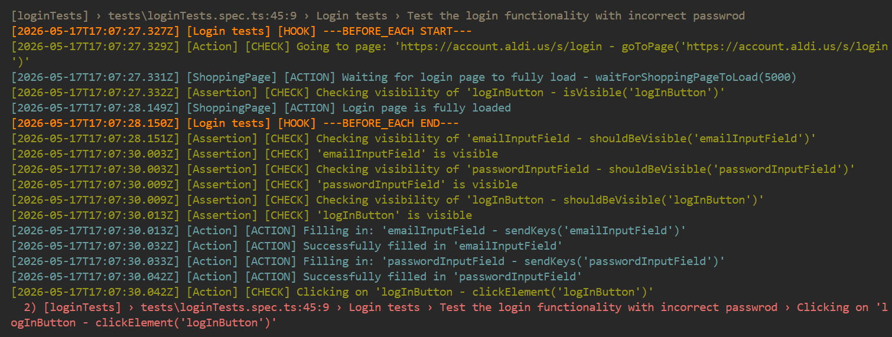

# Task2 Answers

---

## Why Playwright?

Playwright is one of the most modern any widely used Test Automation Framework. This framework has a lot of built in feature which other automation tools don't have like the playwright tracer and also the storage state where we can save a state of a page. This is useful if we don't want to log in every time we execute a new test.

## Why Typescript?

Since Angular is a Typescript based framework then it is also beneficial if the Test Automation framework is Typescript based because in this case the Automation team is able to get help from the Frontend Team if needed. Another reason would be that on some projects the Automation framework is inside the same repo as the FE.

---

## How to set up the Framework?

1. Install the latest node version from [here](https://nodejs.org/en/download)
2. Install dependencies with the following command: `npm install`
3. Install playwright with the following command `npx playwright install`

---

## How to use the framework?

### Structure

#### Test files

You can find the test files inside the tests folder.

```typescript
import { test } from '@playwright/test';
import { Assertion } from '../utils/assertion';
import { LoginPage } from '../pages/loginPage';
import { TestLogger } from '../helpers/testLogger';
import { Action } from '../utils/action';
import { ShoppingPage } from '../pages/shoppingPage';
import { configManager } from '../config/config';

test.describe('Login tests', ()=>{
    const config = configManager.getConfig();

    let ACTION: Action;
    let CHECK: Assertion;
    let LOGGER: TestLogger; 
    let loginPage: LoginPage;
    let shoppingPage: ShoppingPage;

    test.beforeEach(async ({page})=>{
        ACTION = new Action(page);
        CHECK = new Assertion();
        LOGGER = new TestLogger('Login tests');
        loginPage = new LoginPage(page);
        shoppingPage = new ShoppingPage(page);

        LOGGER.startHookMessage('BEFORE_EACH');
        ACTION.goToPage(config.environement.loginPageConfig.url);
        ACTION.waitForLoginPageToLoad(config.environement.loginPageConfig.defaultWatingTime);
        LOGGER.endHookMessage('BEFORE_EACH');
    });

    test('Test the login functionality with valid user data', async () => {
        await CHECK.shouldBeVisible(loginPage.emailInputField);
        await CHECK.shouldBeVisible(loginPage.passwordInputField);
        await CHECK.shouldBeVisible(loginPage.logInButton);

        await ACTION.sendKeys(loginPage.emailInputField, config.credentials.email);
        await ACTION.sendKeys(loginPage.passwordInputField, config.credentials.password);
        await ACTION.clickElement(loginPage.logInButton);
        await ACTION.waitForShoppingPageToLoad(config.environement.shoppingPageConfig.defaultWatingTime);
        await CHECK.shouldBeVisible(shoppingPage.accountButton);
        await CHECK.shouldBeVisible(shoppingPage.cartButton);
        await CHECK.shouldContainText(shoppingPage.accountButton, config.credentials.firstName);
    });

    test('Test the login functionality with incorrect passwrod', async () => {
        await CHECK.shouldBeVisible(loginPage.emailInputField);
        await CHECK.shouldBeVisible(loginPage.passwordInputField);
        await CHECK.shouldBeVisible(loginPage.logInButton);

        await ACTION.sendKeys(loginPage.emailInputField, config.credentials.email);
        await ACTION.sendKeys(loginPage.passwordInputField, config.credentials.incorrectPassword);
        await ACTION.clickElement(loginPage.logInButton);
        await ACTION.waitForLoginPageToLoad(config.environement.loginPageConfig.defaultWatingTime);
        await CHECK.shouldNotBeVisible(shoppingPage.accountButton);
        await CHECK.shouldNotBeVisible(shoppingPage.cartButton);
    });
});
```

Every test is made up of ACTION and CHECK pairs. You can have as many ACTIONs after each other as you want but when you end the ACTION part of the step you should follow it up with a CHECKs. After the CHECK part is finished you should create an empty line before writing the next ACTION part.

Inside the beforeEach method we have a custom logging solution which in the logs helps us identify the start and end of the hook.

#### Action and Assertion files

Action methods can be found in the utils/action.ts and assertions can be found inside the utils/assertion.ts

##### Action

```typescript
    clickElement = async (webElement: WebElement): Promise<void> => {
        const stepDescription = `Clicking on '${webElement.name} - clickElement('${webElement.name}')'`;
        await test.step(stepDescription, async ()=>{
            this.testLogger.check(stepDescription);
            await webElement.locator.click();
            this.testLogger.action(`Successfully clicked '${webElement.name}'`);
        });
    }
```

The action methods are wrapped inside a test.step block so when checking the playwright reports we can only see our custom logs.

##### Assertion

```typescript
    shouldBeVisible = async (webElement: WebElement): Promise<void> => {
        const stepDescription = `Checking visibility of '${webElement.name} - shouldBeVisible('${webElement.name}')'`;
        await test.step(stepDescription, async ()=>{
            this.testLogger.check(stepDescription);
            try{
                await expect(webElement.locator).toBeVisible();
                this.testLogger.check(`'${webElement.name}' is visible`);
            } catch (error) {
                this.testLogger.errorLog(`'${webElement.name}' is not visible`);
                throw error;
            }
        });
    }
```

Assertion methods structured similarly like the action methods with the extension of a try-catch block. This block allows us to have a custom logging message when the assertion fails.

##### Locators and page specific methods

Locators and page specific methods are stored inside the pages folder. An example file for this is the loginPage.ts

```typescript
import test, { Page } from "@playwright/test";
import { BasePage } from "./basePage";
import { WebElement } from "../utils/webElement";
import { TestLogger } from "../helpers/testLogger";
import { Assertion } from "../utils/assertion";

export class LoginPage extends BasePage {
    testLogger: TestLogger;
    check: Assertion;

    readonly emailInputField = new WebElement('emailInputField', this.getElement("input[name='email']"));
    readonly passwordInputField = new WebElement('passwordInputField', this.getElement('input[name="passw"]'));
    readonly logInButton = new WebElement('logInButton', this.getElement('button[title="Log In"]'));
    readonly loadingIndicator = new WebElement('logInButton', this.getElement('[class="loading"]]'));

    constructor(page: Page) {
        super(page);
        this.testLogger = new TestLogger('ShoppingPage');
        this.check = new Assertion();
    }

    waitForLoginPageToLoad = async(timeout: number): Promise<void> => {
        const stepDescription = `Waiting for login page to fully load - waitForShoppingPageToLoad(${timeout})`;
        await test.step(stepDescription, async () => {
            this.testLogger.action(stepDescription);
            if(await this.check.isVisible(this.loadingIndicator)) {
                await this.check.shouldNotBeVisible(this.loadingIndicator);
            }
            this.testLogger.action('Login page is fully loaded');
        });
    }
}
```

Locators are stored inside WebElement objects which have 2 properties, name (we need this for our logging) and a Locator object.

As you can see we have a waitLoginPageToLoad method implemented here but the tests aren't calling this method directly from here but from a waitForLoginPageToLoad method which is inside the action file.

##### Logging

We have our custom logging solution implemented inside the helpers folder.

We have 5 types of logs implemented: action, check, infoLog, errorLog, hook.

Here is an example how our logging looks like:



##### Configuration

Files about the configuration can be found inside the config folder.

Here we have filed:
* config.json - this file contains the configuration which is not sensitive data like
  * urls for the pages
  * defaultWaiting time for each page
* config.ts - this is where we load the configuration into our config object
  * Configuration comes from 2 places
    * config.json with the not sensitive data
    * CREDENTIALS environment variable which contains the sensitive data like:
      * email
      * password
      * firstName
      * lastName
      * invalidPassword
* types - this file contains the data structure for our config

#### How to run a test?

Inside the package.json file we have scripts which you can run with the right click run scrip option 